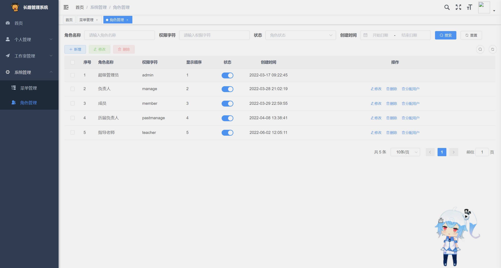

<p align="center">
	
</p>
<h1 align="center" style="margin: 30px 0 30px; font-weight: bold;">Studio-Vue V1.2.0</h1>
<p align="center">
    <a href="https://github.com/changlua/studio-vue/releases/tag/v1.2.0"></a>
	<a href="https://github.com/changlua/studio-vue/blob/master/LICENSE"></a>


</p>


# 前言

去年在工作室偶然听到其他工作室要做一个官网，接着趁着一时兴起然后也找了个模板来做了一个自己的官网以及一个后台管理系统，当时的后台系统只有一个登录、注册还有一个提交个人信息的页面，主要为了方便展示动态汇总团队成员。

想要将这个工作室管理系统继续做下去我自己总结了几个原因：①再此之前我也在gitee、github上搜索了相关学校工作室、实验室管理系统，没有发现比较完善的，较好的。②为了在简历上有些亮点。③将自己所学到的一个技术能够有一个应用场景，助推自己的技术学习与进步。

今年也正好趁毕业设计这个为主题继续进行了开发，耗时近一个月将后台管理系统进行了初步完善。

该工作室系统主要面向校园工作室，可供个人及工作室团队学习使用。

**鸣谢**：

- 感谢 [RUOYI](https://gitee.com/y_project/RuoYi) 提供的后台管理系统模板以及后台路由、权限管理。【项目功能引用了若依的角色、菜单管理】
- 感谢项目logo：[来源网站地址](https://www.flaticon.com/search?word=deer)、作者[Hery Mery](https://www.flaticon.com/authors/hery-mery)

**Studio-Vue演示地址**：https://www.codercl.cn/

+ 用户名：admin  密码：123

项目部署上线完整教程：[Studio-Vue校园实验室系统(SpringBoot+Vue)部署上线保姆级教程](https://www.bilibili.com/video/BV1R64y1J7gW/?spm_id_from=333.999.0.0&vd_source=b19269a4ae00481d5ff13d1897127b8b)

对应小程序端开源地址：[studio-wx（Gitee）](https://gitee.com/changluJava/studio-wx)、[studio-wx（Github）](https://github.com/changlua/studio-wx)

# 项目介绍
## 项目演示

### 官网

<table>
    <tr>
        <td></td>
        <td></td>
    </tr>
    <tr>
        <td></td>
        <td></td>
    </tr>
    <tr>
        <td></td>
        <td></td>
    </tr>
	<tr>
        <td></td>
    </tr>	 
</table>


### 后台管理系统

<table>
    <tr>
        <td></td>
        <td></td>
    </tr>
    <tr>
        <td></td>
        <td></td>
    </tr>
    <tr>
        <td></td>
        <td></td>
    </tr>
	<tr>
        <td></td>
    <td></td>
    </tr>	 
    <tr>
        <td></td>
    <td></td>
    </tr>	 
    <tr>
        <td></td>
    <td></td>
    </tr>	 
    <tr>
        <td></td>
    <td></td>
    </tr>	 
    <tr>
        <td></td>
    </tr>	 
</table>

## 技术选型

### 后端技术

|      技术      |            说明             |                          官网                          |
| :------------: | :-------------------------: | :----------------------------------------------------: |
|   SpringBoot   | 快速集成框架，使用web启动器 |         https://spring.io/projects/spring-boot         |
|  MybatisPlus   |           ORM框架           |                 https://baomidou.com/                  |
| SpringSecurity |           log4j2            |    https://spring.io/projects/spring-security#learn    |
|      JWT       |          登录鉴权           |              https://github.com/jwtk/jjwt              |
|     log4j2     |          日志框架           | https://logging.apache.org/log4j/2.x/manual/index.html |
|   PageHelper   |          分页插件           |             https://pagehelper.github.io/              |
|      OSS       |       第三方对象存储        |     https://github.com/aliyun/aliyun-oss-java-sdk      |
|     Lombok     |      简化对象封装工具       |               https://projectlombok.org/               |
|      poi       |          Excel工具          |                https://poi.apache.org/                 |
|  easy-captcha  |       验证码生成工具        |        https://gitee.com/ele-admin/EasyCaptcha         |
|     redis      |         缓存中间件          |                   https://redis.io/                    |

### 前端技术

|    技术    |            说明             |                             官网                             |
| :--------: | :-------------------------: | :----------------------------------------------------------: |
|    Vue2    |        前端主流框架         |                      https://vuejs.org/                      |
| Element-UI |        饿了吗UI框架         |                  https://element.eleme.io/                   |
|  Echarts   |       Echarts图表框架       |           https://echarts.apache.org/zh/index.html           |
|   Axios    |        前端HTTP框架         |                   http://www.axios-js.com/                   |
| js-cookie  |       cookie管理工具        |            https://github.com/js-cookie/js-cookie            |
| jsencrypt  | 加密解密工具，非对称加密RSA |             https://github.com/travist/jsencrypt             |
| nprogress  |         进度条控件          |            https://github.com/rstacruz/nprogress             |
|   live2d   |           看板娘            | 集成vue教程：https://blog.csdn.net/hk1052606583/article/details/122718918 |

### 运维部署
|  技术  |            说明            |              官网              |
| :----: | :------------------------: | :----------------------------: |
| Nginx  |       静态资源服务器       | https://github.com/nginx/nginx |
| Docker | 应用容器引擎(快速隔离部署) |    https://www.docker.com/     |

### 开发进度

    

# 内置功能

> 工作室官网

前台页面：

+ 首页：banner图展示、证书展示、
+ 时光轴页
+ 团队页(动态数据获取展示)

> 工作室后台管理系统

首页（Echarts数据展示）：工作室数据统计；依据年级，专业获奖证书以及竞赛统计图表展示；

个人信息页：更新个人信息、修改密码

个人管理模块：

+ 信息录入：成员信息录入，用于官网展示
+ 获奖证书：查询、新增、编辑、修改、删除
+ 个人竞赛：查询、新增、编辑、修改、删除
+ 个人心得：查询、新增、编辑、修改、删除

工作室管理模块：

+ 专业管理：查询、新增、编辑、修改、删除
+ 年级管理：查询、新增、编辑、修改、删除
+ 获奖证书管理：查询、修改、导出
+ 竞赛管理（录入团队比赛）：新增、修改、删除、导出
+ 成员管理：查询、编辑、修改、删除、注销，激活，删除账号、新建账号、导出用户、转让负责人、重置密码、数据备份

系统管理模块（引用若依）：

+ 菜单管理：查询、添加、修改、删除
+ 角色管理：查询、添加、修改、删除、修改状态；
  + 分配用户：查询、批量授权

> 其他

文件上传接口：支持本地或者阿里云OSS存储，仅需配置下即可。

# 项目文档

API文档：https://www.apifox.cn/apidoc/shared-456aee99-6931-48e5-bdd4-89c012d0178c

数据库表关系设计：

  

数据库表字段设计：

  

# 快速开始

## 版本2下载位置

[tags](https://gitee.com/changluJava/studio-vue/tags)


---

## 本地运行（v1.2版本）

> 本地环境

环境：Windows系统

开发工具：IDEA2020

项目构建工具：Maven3.6.3

数据库：MySQL 5.7、Redis

前端环境：Node.js、Npm

> 本地环境构建运行

**1、克隆本项目**

```shell
# github仓库
git clone https://github.com/changlua/Studio-Vue.git

# gitee仓库
git clone https://gitee.com/changluJava/studio-vue.git
```

**2、启动后台服务**

①、IDEA打开项目，配置yaml文件

修改`studio-admin/application-dev`文件中的数据库地址以及连接数据库名称与密码、redis的密码。

②、导入sql/studio.sql

操作方式：直接导入即可，在sql中已经添加了创建数据库的sql语句了，不用你自己先创建数据库，默认是studio。

③运行studio-admin的启动类。  

**3、运行后台管理系统前端vue项目**

进入到studio-ui目录下，执行命令安装依赖并运行：

```shell
# 安装依赖
npm install

# 运行项目
npm run dev
```

访问：http://localhost:8089

当前管理系统仅有一个系统管理员账号：admin 123

**4、运行静态页面**

进入到studio-front目录下，打开index.html即可进入到首页，team.html即为团队页。

+ team.html中会发送请求到后台获取所有用户的数据。

## Linux服务器部署（v1.2版本）

### 准备工作

在服务器根目录/下创建mydata文件夹，将mydata目录下的内容拷贝到其中：

对应的文件内容在仓库的docker-compose目录下：

  

复制到服务器后如下：


  云服务器开启多个端口(如下)：实际最终只开放一个端口，其他端口仅仅是在过程中会需要开放一下用来测试

 

---

### 安装Docker以及Docker-Compose

>安装Docker

见这篇博客：[快速使用Docker部署MySQL、Redis、Nginx](https://changlu.blog.csdn.net/article/details/124394266)


>安装Docker-Compose

见这篇博客：[docker-compose快速入门及实战](https://blog.csdn.net/cl939974883/article/details/126463806?csdn_share_tail=%7B%22type%22%3A%22blog%22%2C%22rType%22%3A%22article%22%2C%22rId%22%3A%22126463806%22%2C%22source%22%3A%22cl939974883%22%7D)

**对应的docker-compose文件已上传docker-compose目录**：

  

---

### 1、启动基础服务（mysql、redis）

**步骤一、启动docker-compose的基础服务文件，启动mysql与redis**

①启动前设置`docker-compose-basic.yml`文件中的redis密码，在35行`--requirepass`后。

②启动docker-compose文件：

```shell
# 进入到/mydata目录
cd /mydata

# 启动docker-compose-basic文件
docker-compose -f docker-compose-basic.yml up -d 	
```

> docker-compose-basic.yml如下所示：

`docker-compose-basic.yml`：

```yaml
version: '3.1'

networks:
  studio-net:  # 网络名
    name: studio-net
    driver: bridge

services:
  mysql:
    image: library/mysql:5.7.36
    restart: always
    container_name: mysql
    ports:
      - 3306:3306
    environment:
      - MYSQL_ROOT_PASSWORD=root
    volumes:
      - "/etc/localtime:/etc/localtime"
      - "/mydata/mysql/log:/var/log/mysql"
      - "/mydata/mysql/data:/var/lib/mysql"
      - "/mydata/mysql/conf:/etc/mysql/mysql.conf.d"
    networks:
      - studio-net
  redis:
    image: library/redis:5
    restart: always
    container_name: redis
    ports:
      - 6379:6379
    volumes:
      - "/mydata/redis/redis.conf:/etc/redis/redis.conf"
      - "/mydata/redis/data:/data"
    networks:
      - studio-net
    command: ["redis-server","/etc/redis/redis.conf","--appendonly yes", "--requirepass SZcmfGJGUD4v"]
```

**步骤二：创建mysql用户，并导入sql文件**

①设置mysql密码操作如下：

```shell
# 使用mysql容器中的命令行
docker exec -it mysql /bin/bash

# 使用MySQL命令打开客户端：
mysql -uroot -proot --default-character-set=utf8

# 接着创建一个账户，该账号所有ip都能够访问
# 用户名：root  密码：123456
grant all privileges on *.* to 'root' @'%' identified by '123456';
```

②导入sql文件：建议是进行远程连接导入，导入的sql如下：

    

+ `studio.sql`：仅仅只有一个用户账号。
+ `studio-simple1.sql`：与演示网站的数据一致。

导入`studio.sql`后的效果如下：

  

### 2、IDEA构建镜像上传服务器

**准备**：开启云服务器上安全组的2375端口。【提示：请在上传镜像的时候开启，开的时间比较长这个2375端口容易被种病毒，我曾中过】

  

**步骤一：开启服务器上docker的2375端口监听**

修改配置文件：

```shell
# 编辑打开其中的docker.service文件
vim /usr/lib/systemd/system/docker.service

# 将其中的execstart进行替换
ExecStart=/usr/bin/dockerd -H tcp://0.0.0.0:2375 -H unix://var/run/docker.sock
```

然后重新加载docker.server文件并重启docker服务：

```shell
# 重新加载服务配置docker.server
systemctl daemon-reload
# 重新启动docker
systemctl restart docker
```

来测试一下当前2375端口是否在监听：

```shell
# 若是出现json文件内容说明已经在监听了
curl http://127.0.0.1:2375/version

# 查看下2375端口是否被监听
netstat -nlpt

# 服务器防火墙开启2375端口
firewall-cmd --add-port=2375/tcp --permanent
firewall-cmd --reload
firewall-cmd --zone=public --list-ports
```

**步骤二：本地IDEA来测试是否能够连通服务器的docker服务**

```
tcp://192.168.3.83:2375
```

  

**步骤三：修改远程Docker的服务ip地址**

```shell
<dockerHost>http://192.168.3.83:2375</dockerHost>
```

  

修改好之后，我们来手动进行构建studio.admin的jar包：

 

接着我们来执行docker:build命令来进行打包镜像并上传服务器：

  

构建成功的效果如下：

  

  

---

### 3、启动最终服务（studio-admin、nginx服务）

#### https（若是要使用https的配置我们需要将）

我们需要自己将/mydata目录中的nginx/conf.d配置文件下的配置文件替换为这个：

  

默认在mydata目录下的是我们http配置。

---

#### http版本（没有ssl证书选择使用这个）

  

启动最终服务compose文件：

```shell
docker-compose -f docker-compose-studio.yml up -d 
```

ok，至此我们就已经部署服务结束：

 

> docker-compose-studio.yml配置文件如下


```shell
version: '3.1'

# 外部网络声明（否则无法使用之前已经定义好的网络）
networks:
  studio-net:
    external: true

services:
  studio:  # studio实验室
    image: studio/studio-admin:latest
    container_name: studo-admin
    ports:
      - 8999:8999
    volumes:
      - "/etc/localtime:/etc/localtime"
      - "/mydata/project/studio-admin/logs:/tmp/logs"
      - "/mydata/nginx/html/static:/tmp/static"
    networks:
      - studio-net
  nginx:   # nginx服务
    image: library/nginx:1.10
    container_name: nginx
    ports:
      - 80:80
      - 443:443
    volumes:
      - "/mydata/nginx/html:/usr/share/nginx/html"
      - "/mydata/nginx/logs:/var/log/nginx"
      - "/mydata/nginx/conf:/etc/nginx"
    networks:
      - studio-net
    depends_on:
      - studio
```

### 4、上传前端页面（官网、后台系统）

#### 前置准备

在目录``/mydata/nginx/html`下创建两个文件，分别是admin与front，前者放后台系统，后者放官网：

  

#### 官网

在仓库中官网页面为：`studio-front`，纯html静态页面。

  

①修改front路径，上传官网页面

修改第一处：`team.js`，也就是其中的接口路径

```shell
# 替换ip地址即可
const url = "http://192.168.3.83/api/common/members"
```

  

修改第二处：index.html，登录注册页面跳转路径

```shell
<!-- 同样修改ip地址即可 -->
<li><a class="loginbtn" href="http://192.168.3.83/admin/" target="_blank">登陆/注册</a></li>
```

  

最后就是上传到服务器：

  

#### 后台系统

在仓库中的项目工程为`studio-ui`，是一个vue项目

**修改一：修改生产环境的ip地址**

```shell
# 只需要替换ip地址即可
BASE_URL: '"http://192.168.3.83/api"'
```

  

接着我们来进行打包vue工程：

```shell
# 编译打包
npm run build
```

打包完成后就会在dist目录下生成静态资源：

  

最终我们同样是将这个静态页面传到服务器的admin目录下：

  

+ 这个favicon.ico就是之前front目录下的，网站图标。

### 测试

部署完成之后来进行测试：我这里的话是本地虚拟机搭建的地址，你只需要替换为你自己的生产ip地址即可

官网：http://192.168.3.83/

  

后台管理系统：http://192.168.3.83/admin/，点击页面右的登录注册即可跳转。

初始账号目前只有一个就是管理员：

```
admin  123
```

  

---

# 日志

2023.12.28：解决了https部署的443映射问题，docker-compose文件的映射443端口nginx未设置

2023.12.27：修改原先生产配置文件的mysql容器名问题，重新提交tags 1.2.0标签

2023.7.27：修改studio-vue 1.2版本部署部分问题，包含图片上传后访问不了、Linux服务器部署。

2022.10.20：提交v1.2.0版本（支持docker-compose部署）。

2022.9.25：docker-compose文件来替换docker命令，更新README.md中Linux服务器部署章节。

2022.6.13：开源仓库建立，READEME更新完善。

2022.6.3-6.12：项目模块更改名称、apifox文档整理、开源计划准备。

2022.6.2：团队页接口更新，支持指导老师身份。

2022.6.1：新增数据备份功能，包含sql与网站图片资源。

2022.5.6：两个上传功能合并到一起，采用工厂模式，进行改写复用。

2022.4.22：新增上传、删除本地文件功能

2022.4.18：生成用户成员查询sql添加筛选条件状态为正常的账号。

2022.4.17：个人竞赛中获奖证书新增、首页统计bug

2022.4.16：①看板娘实现拖拽。②用户登录凭证将用户id改为uuid。

2022.3.21-2022.4.15：v1.0.0初步完成，基本功能实现。

2021.11.22-2021.12.5：工作室官网、工作室后台系统实现，最小核心功能就是实现工作室成员的信息上传。

# 交流学习

QQ群：571215225

作者QQ：939974883